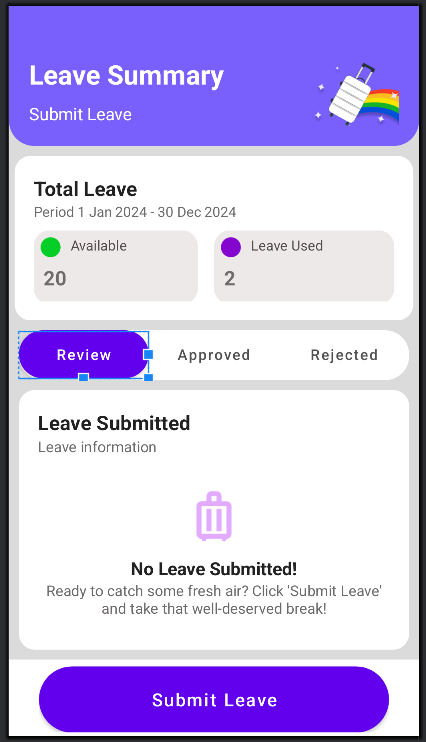
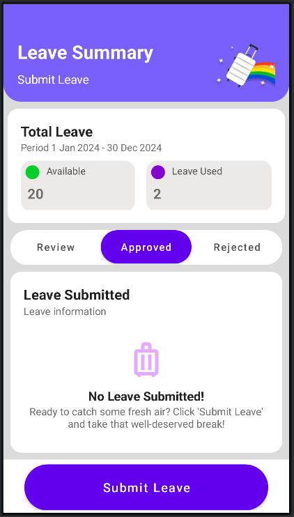
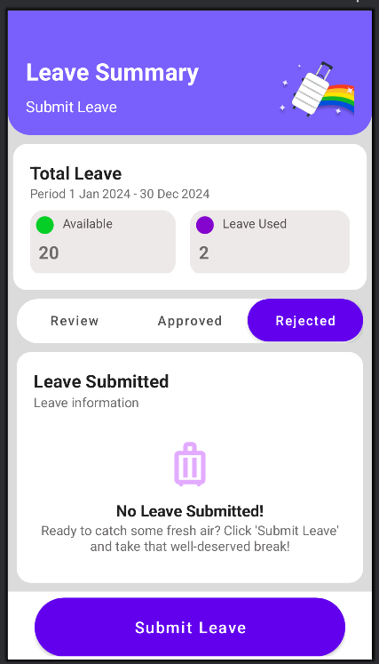
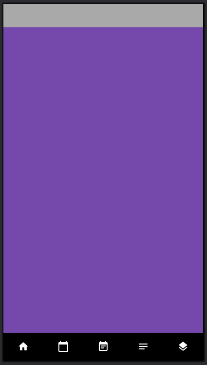

# AndroidApplication

A simple android application for midterm

⚠️ **Warning:**  This app is written completely blindly.
⚠️ **Warning:**  Had absolutely no chance to run the code (to check the logic or design)
⚠️ **Warning:**  My laptop (my Sheila) is shutting down every time I press "run" 

Requirements:
- To make 'BottomNavigationView' ✅
- To make 'TabLayout' with 'ViewPager' ✅
- To be close to a given Figma design ✅ (CLOSE...! the requirement was TO BE CLOSE)
- To write logic for 'BottomNavigationView' ❎
- To appear a 'Dialog Fragment' when clicked on 'Submit Leave' ❎


# Screenshots

### Leave Summary / Review




### Leave Summary / Approved




### Leave Summary / Rejected




### Bottom Navigation




## 🛠️ Tech stuff

- Language: Kotlin / Java
- Editor: Android Studio


## 📦 Installation

1. Clone the repository:
    ```bash
   git clone https://github.com/Mari-Tchokhuri/AndroidApplication.git


